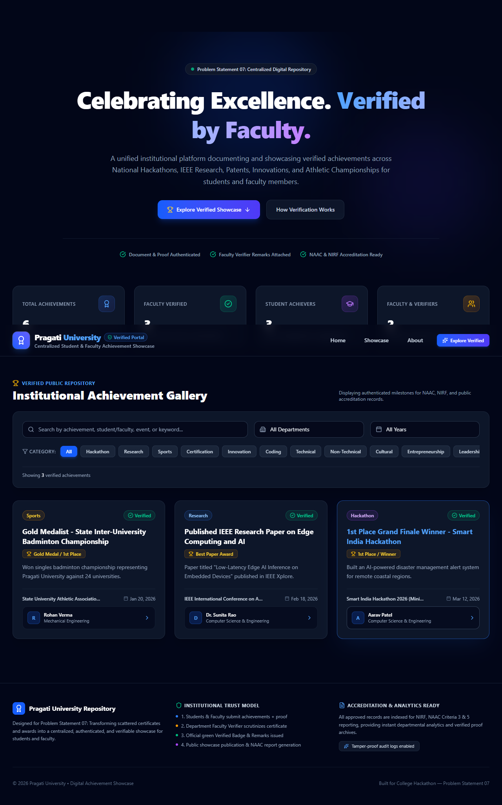
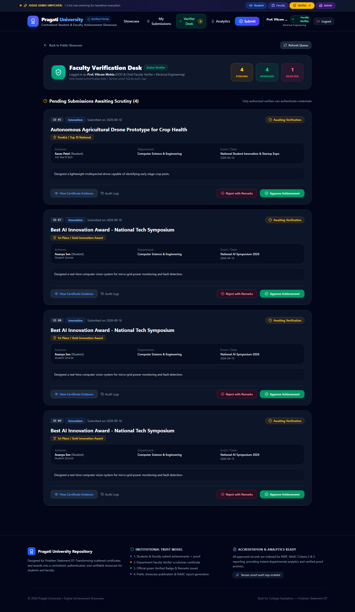
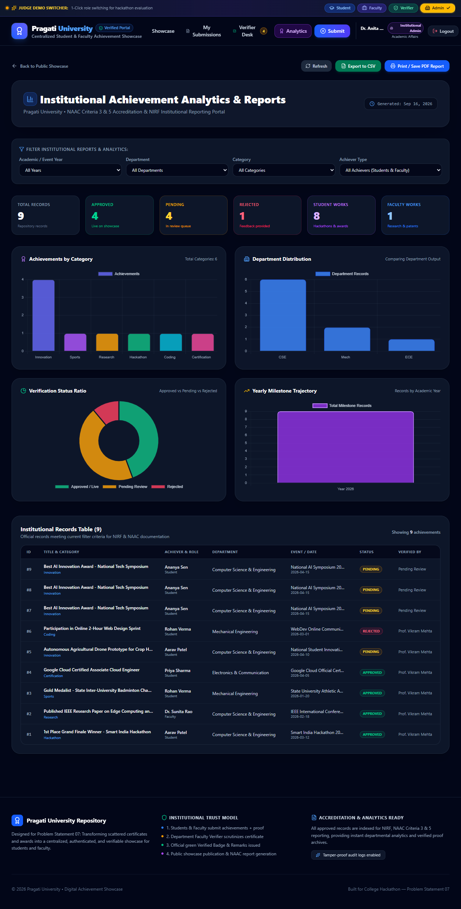
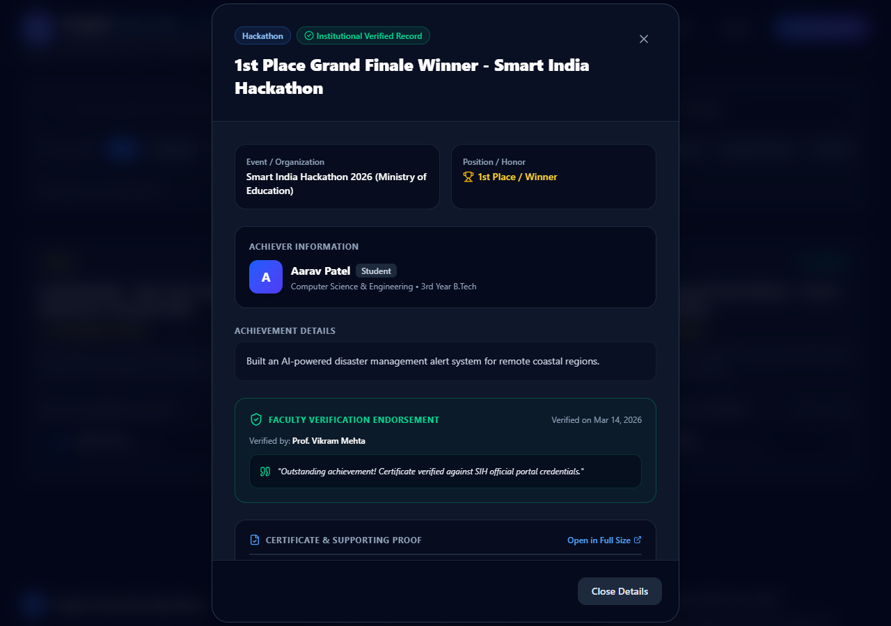
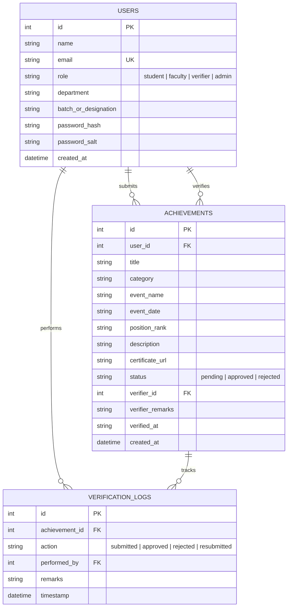

# 🏆 MeritHub — Centralized Digital Student & Faculty Achievement Repository

> **Problem Statement 07:** Centralized Institutional Repository for Documenting, Authenticating, and Showcasing Verified Student & Faculty Achievements.

[](https://react.dev/)
[](https://vitejs.dev/)
[](https://expressjs.com/)
[](https://sqlite.org/)
[](https://tailwindcss.com/)
[](#-enterprise-security--authentication)
[](#-institutional-analytics--accreditation-reporting)

---

## 📌 Executive Summary & Problem Context

Higher education institutions face severe challenges in managing student and faculty accomplishments:
* **Fragmented Records:** Achievements in national hackathons, IEEE journals, patents, athletic championships, and cultural awards are scattered across paper certificates, email threads, and disparate departmental spreadsheets.
* **Unverified Claims:** Lack of authenticated verification workflows allows unverified or inflated accomplishments to go unchecked.
* **Accreditation Overhead:** Compiling verified evidence for **NAAC (Criterion 3 & 5)**, **NIRF**, and **NBA** accreditation requires weeks of manual, error-prone data gathering.
* **No Centralized Showcase:** Deserving students and faculty lack a unified, prestigious institutional gallery celebrating their excellence.

**MeritHub** solves these challenges with a single, end-to-end institutional platform featuring **Role-Based Access Control (RBAC)**, **Faculty Verifier Workflows**, **Tamper-Evident Audit Logging**, **Accreditation Intelligence Reporting**, and an interactive **Public Achievement Showcase**.

---

## 📸 Platform Highlights & Visual Walkthrough

| Public Achievement Showcase | Faculty Verifier Desk |
|:---:|:---:|
|  |  |
| *Verified public gallery with multi-criteria filtering* | *Faculty scrutiny queue for approving/rejecting submissions* |

| Institutional Analytics Dashboard | Full Audit & Detail Modal |
|:---:|:---:|
|  |  |
| *Executive KPI metrics and one-click NAAC/NIRF CSV export* | *Embedded certificate viewer with faculty verification stamps* |

---

## 🚀 Key Features & Implemented Functionalities

### 1. 🌐 Public Achievement Showcase & Discovery Engine
* **Verified Public Feed:** Displays authenticated achievements with position badges, category indicators, event dates, and submitter credentials.
* **Multi-Dimensional Filtering:** Instant client-side filtering by:
  * **Category:** Hackathon, Research Publication, Patent, Sports & Athletics, Academic Excellence, Cultural & Arts.
  * **Department:** Computer Science, Electronics, Mechanical, Electrical, Civil Engineering.
  * **Academic Year:** Real-time temporal filtering.
* **Live Institutional Metrics Bar:** Dynamic counter displaying Total Achievements, Verified Count, Pending Queue, Registered Students, and Faculty Members.
* **Interactive Achievement Modal:** High-resolution modal providing:
  * Comprehensive project / achievement description.
  * Embedded **Certificate & Proof Viewer** supporting high-resolution images and PDFs.
  * Faculty Verifier endorsement badge, remarks, and cryptographic verification timestamp.
  * Direct link to complete historical audit logs.

### 2. 🛡️ Role-Based Access Control (RBAC) & Authentication
* **4 Pre-configured Institutional Personas:**
  * 🎓 **Student (`student`):** Submit achievements, track personal portfolio in "My Submissions", view rejection feedback, fix and resubmit.
  * 👨‍🏫 **Faculty (`faculty`):** Submit research publications, patents, conference keynotes, and departmental honors.
  * 🔍 **Faculty Verifier (`verifier`):** Access the restricted Verifier Desk, scrutinize submitted evidence/certificates, approve with remarks, or reject with mandatory remediation notes.
  * 🏛️ **Admin / Dean / HOD (`admin`):** Access the Institutional Analytics Dashboard, NAAC/NIRF reporting, and comprehensive system oversight.
* **Cryptographic Security:** Passwords hashed with **PBKDF2** (salt + 10,000 iterations, SHA-512).
* **Tamper-Proof Session Tokens:** HMAC-SHA256 signed bearer tokens with 7-day expiration.
* **Brute-Force Protection:** In-memory rate limiting restricting repeated login attempts.
* **Role Guards & Access Denied Screens:** Unauthorized access to verifier or analytics views immediately displays a secure access-denied state with one-click redirection.

### 3. 📝 Submissions & Dynamic Evidence Uploads
* **Intuitive Submission Portal:** Form tailored to capture title, category, event/organizer, achievement date, position/rank, and detailed abstract.
* **Multer File Pipeline:**
  * Enforces a **5 MB size limit**.
  * File-type whitelisting (`.pdf`, `.png`, `.jpg`, `.jpeg`).
  * Sanitized file naming preventing path traversal attacks.
* **Initial State Protection:** All new submissions are automatically tagged as `PENDING` and hidden from the public showcase until authorized.

### 4. 🧑‍⚖️ Faculty Verifier Desk & Approval Lifecycle
* **Real-time Pending Queue:** Dedicated dashboard showing submissions awaiting scrutiny with live badge counters.
* **One-Click Approval:** Verifiers can attach formal institutional remarks that become permanently visible on the verified certificate badge.
* **Constructive Rejection Workflow:**
  * Mandatory remarks field explaining the exact remediation needed (e.g., "Missing official seal", "Duplicate submission").
  * Automatically notifies submitter through their private dashboard.
* **Audit Trail Generation:** Automatically logs every review decision with verifier ID, timestamp, and action.

### 5. 🔄 "My Submissions" Portfolio & Resubmission Loop
* **Personal Tracker:** Submitters can track all their contributions categorized by status (`APPROVED` in green, `PENDING` in amber, `REJECTED` in rose).
* **Feedback Inspection:** View detailed verifier remarks on rejected items.
* **Resubmission Modal:** Submitters can rectify rejected submissions by updating event details or uploading a replacement certificate/proof. Re-submitting seamlessly re-queues the record for verification.

### 6. 📊 Institutional Analytics & NAAC / NIRF Accreditation Reporting
* **Executive Summary KPIs:**
  * Total Submissions
  * Approved / Verified Achievements
  * Pending Scrutiny Queue
  * Rejected / Rework Submissions
  * Student vs. Faculty Contribution Distribution
* **Visual Analytical Charts:**
  * Achievement distribution by Category.
  * Departmental performance ranking & leaderboard.
  * Year-over-year accomplishment trajectory.
* **One-Click CSV Accreditation Export:** Generates structured reports conforming to NAAC Criterion 3 & 5 and NIRF audit formats, complete with achiever details, event names, ranks, and verification timestamps.

### 7. 🎯 Judge Demo Mode & One-Click Tour
* **Top Judge Banner:** Persistent banner allowing hackathon evaluators and recruiters to instantly switch between **Student**, **Faculty**, **Verifier**, and **Admin** with a single click.
* **Interactive Guided Tour:** Walkthrough modal presenting the architecture, workflow stages, and evaluation criteria.

---

## 🏗️ Architecture & Technology Stack

```
merithub/
├── client/                     # Frontend Application (React + Vite)
│   ├── src/
│   │   ├── components/         # Modular UI Components
│   │   │   ├── Navbar.jsx              # Navigation & user state
│   │   │   ├── Hero.jsx                # Institutional hero banner
│   │   │   ├── Stats.jsx               # Live platform counter stats
│   │   │   ├── SearchFilters.jsx       # Category/Department/Year filters
│   │   │   ├── AchievementCard.jsx     # Showcase grid card
│   │   │   ├── AchievementModal.jsx    # Full modal with certificate viewer
│   │   │   ├── SubmitForm.jsx          # Achievement upload form
│   │   │   ├── MySubmissions.jsx       # Personal status tracker
│   │   │   ├── VerifierDesk.jsx        # Faculty verification portal
│   │   │   ├── ResubmitModal.jsx       # Re-submission & remediation modal
│   │   │   ├── AnalyticsDashboard.jsx  # HOD & Admin charts and reporting
│   │   │   ├── LoginPage.jsx           # Credential & demo account login
│   │   │   ├── JudgeDemoBanner.jsx     # 1-click evaluator role switcher
│   │   │   ├── JudgeTourModal.jsx      # Guided walkthrough modal
│   │   │   ├── AuditLogsModal.jsx      # Complete verification history
│   │   │   ├── CertificateViewerModal.jsx # Zoomable credential viewer
│   │   │   └── AccessDenied.jsx        # RBAC protection guard screen
│   │   ├── App.jsx             # Main view orchestration & state
│   │   └── main.jsx            # React root
│   └── package.json
│
├── server/                     # Backend API Server (Node.js + Express)
│   ├── database/
│   │   ├── db.js               # SQLite connection (WAL mode enabled)
│   │   └── seed.js             # Schema creation & initial dataset
│   ├── uploads/                # Authenticated certificate storage
│   ├── server.js               # REST API endpoints & security middleware
│   └── package.json
└── README.md                   # Comprehensive documentation
```

### Tech Stack Details
* **Frontend:** React 19, Vite, Tailwind CSS, Lucide React (Icons), Canvas-Confetti.
* **Backend:** Node.js, Express 5, Better-SQLite3 (Write-Ahead Logging enabled for high concurrency), Multer.
* **Security:** PBKDF2 Password Hashing, HMAC-SHA256 Signed Tokens, XSS Input Sanitization, HTTP Security Headers (`nosniff`, `DENY` framing, `X-XSS-Protection`), Path Traversal Shielding.

---

## 🗄️ Database Schema

The SQLite database (`showcase.db`) is optimized with three primary relational entities:



---

## 📡 REST API Reference

| Method | Endpoint | Access / Role | Description |
| :--- | :--- | :--- | :--- |
| `GET` | `/api/health` | Public | Backend health & database connection check |
| `GET` | `/api/stats` | Public | Platform-wide achievement & user counters |
| `POST` | `/api/auth/login` | Public (Rate-Limited) | Authenticate user & return HMAC-SHA256 token |
| `POST` | `/api/auth/demo-switch` | Public | Fast role-switch for judges & evaluators |
| `GET` | `/api/auth/me` | Authenticated | Retrieve current session profile |
| `GET` | `/api/achievements` | Public | Fetch approved achievements for showcase feed |
| `POST` | `/api/achievements` | Authenticated | Submit new achievement with certificate upload |
| `GET` | `/api/achievements/pending` | `verifier`, `admin` | Pending submissions queue for verification |
| `POST` | `/api/achievements/:id/approve`| `verifier`, `admin` | Approve submission & publish with faculty remarks |
| `POST` | `/api/achievements/:id/reject` | `verifier`, `admin` | Reject submission with mandatory feedback remarks |
| `POST` | `/api/achievements/:id/resubmit`| Owner / `admin` | Update & re-submit rejected achievement |
| `GET` | `/api/achievements/:id/logs` | Public | Retrieve full audit history of an achievement |
| `GET` | `/api/submissions/my` | Authenticated | Retrieve current user's personal submission list |
| `GET` | `/api/analytics` | `verifier`, `admin` | Aggregated analytics & department/category metrics |
| `GET` | `/api/reports/export-csv` | `verifier`, `admin` | Download filtered records as NAAC/NIRF CSV report |

---

## ⚡ Quick Start & Local Setup Guide

### Prerequisites
* **Node.js** (v18.x or higher)
* **npm** (v9.x or higher)

### 1. Clone the Repository
```bash
git clone https://github.com/25A31A0575/merithub.git
cd merithub
```

### 2. Setup and Start the Backend Server
```bash
cd server
npm install
npm start
```
* Backend runs on: `http://localhost:5000`
* The SQLite database is automatically created and seeded with realistic college sample data on first run.

### 3. Setup and Start the Frontend Client
In a new terminal window:
```bash
cd client
npm install
npm run dev
```
* Frontend runs on: `http://localhost:5173`

---

## 🔑 Demo Accounts for Evaluation

The system comes pre-seeded with sample accounts. You can log in manually or use the **Judge Demo Banner** to switch identities with one click:

| Role | Email | Password | Access Privileges |
| :--- | :--- | :--- | :--- |
| **Student** | `student@pragati.edu` | `student123` | Submit achievements, view "My Submissions", resubmit |
| **Faculty** | `faculty@pragati.edu` | `faculty123` | Submit faculty research papers & patents |
| **Faculty Verifier** | `verifier@pragati.edu` | `verifier123` | Access Verifier Desk, approve/reject submissions |
| **Admin / HOD** | `admin@pragati.edu` | `admin123` | Full access to Analytics Dashboard & CSV export |

---

## 🧪 Testing & Quality Assurance

The repository includes a comprehensive end-to-end automated testing suite verifying all user flows:
```bash
# In the client directory:
node test-master-e2e-suite.js           # Full Master E2E lifecycle test
node test-full-system-verification.js   # API + Database state verification
node test-auth-role-flow.js             # RBAC & authentication boundaries
node test-verifier-flow.js              # Faculty scrutiny approval/rejection test
node test-analytics-flow.js             # Analytics queries and CSV generation test
```

---

## 📜 License

This project is open-source and available under the [MIT License](LICENSE).
